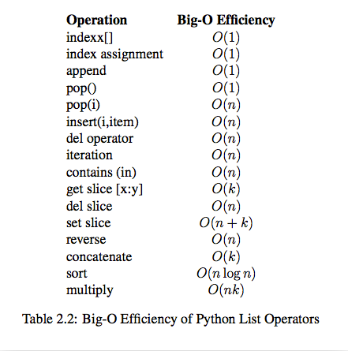
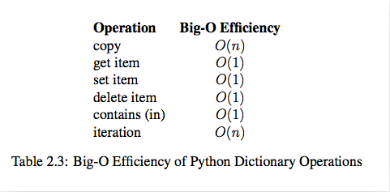

# Python内置类型性能分析
## timeit模块
timeit模块可以用来测试一小段Python代码的执行速度。
```py
class timeit.Timer(stmt='pass', setup='pass', timer=<timer function>)
```

Timer是测量小段代码执行速度的类。

stmt参数是要测试的代码语句（statment）；

setup参数是运行代码时需要的设置；

timer参数是一个定时器函数，与平台有关。
```
timeit.Timer.timeit(number=1000000)

```
Timer类中测试语句执行速度的对象方法。number参数是测试代码时的测试次数，默认为1000000次。方法返回执行代码的平均耗时，一个float类型的秒数。

# list内置操作的时间复杂度


# dict内置操作的时间复杂度


## Python的内置数据结构
Python给我们提供了很多现成的数据结构类型，这些系统自己定义好的，不需要我们自己去定义的数据结构叫做Python的内置数据结构，比如列表、元组、字典。
## Python的扩展数据结构
而有些数据组织方式，Python系统里面没有直接定义，需要我们自己去定义实现这些数据的组织方式，这些数据组织方式称之为Python的扩展数据结构，比如栈，队列等。
## 算法与数据结构的区别

数据结构只是静态的描述了数据元素之间的关系。

高效的程序需要在数据结构的基础上设计和选择算法。

程序 = 数据结构 + 算法

总结：算法是为了解决实际问题而设计的，数据结构是算法需要处理的问题载体

## 抽象数据类型(Abstract Data Type)

抽象数据类型(ADT)的含义是指一个数学模型以及定义在此数学模型上的一组操作。即把数据类型和数据类型上的运算捆在一起，进行封装。引入抽象数据类型的目的是把数据类型的表示和数据类型上运算的实现与这些数据类型和运算在程序中的引用隔开，使它们相互独立。

最常用的数据运算有五种：

    插入
    删除
    修改
    查找
    排序
