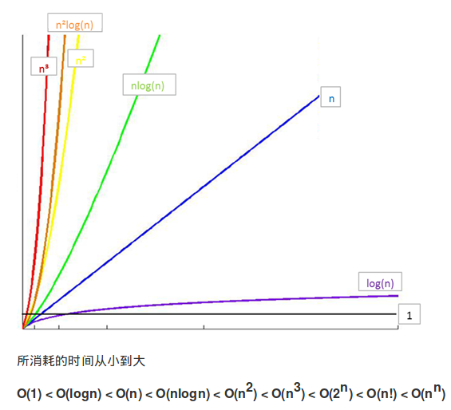
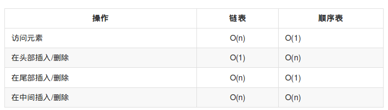
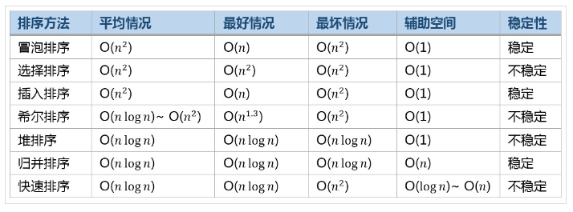
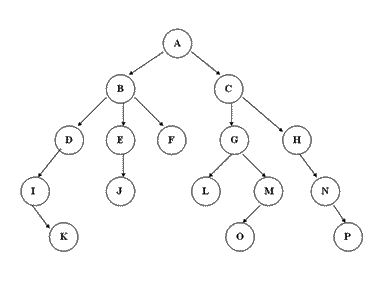
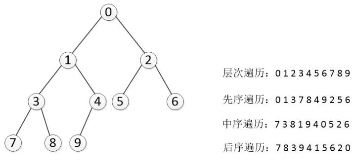

# Data_Structure_with_Python
这是我在学习《基于Python的数据结构》的时候的笔记与代码
主要参考：[数据结构与算法（Python）](https://jackkuo666.github.io/Data_Structure_with_Python_book/)


 
# [0.0.算法效率衡量](https://github.com/JackKuo666/Data_Structure_with_Python/blob/master/0.0.%E7%AE%97%E6%B3%95%E6%95%88%E7%8E%87%E8%A1%A1%E9%87%8F.md)
[代码](https://github.com/JackKuo666/Data_Structure_with_Python/blob/master/0.1.%E7%AE%97%E6%B3%95%E6%95%88%E7%8E%87%E8%A1%A1%E9%87%8F.py)

## 对于算法的时间效率，我们可以用“大O记法”来表示。

“大O记法”：对于单调的整数函数f，如果存在一个整数函数g和实常数c>0，使得对于充分大的n总有f(n)<=c*g(n)，就说函数g是f的一个渐近函数（忽略常数），记为f(n)=O(g(n))。也就是说，在趋向无穷的极限意义下，函数f的增长速度受到函数g的约束，亦即函数f与函数g的特征相似。

时间复杂度：假设存在函数g，使得算法A处理规模为n的问题示例所用时间为T(n)=O(g(n))，则称O(g(n))为算法A的渐近时间复杂度，简称时间复杂度，记为T(n)

## 最坏时间复杂度
算法完成工作最多需要多少基本操作，即最坏时间复杂度

## 时间复杂度的几条基本计算规则
    基本操作，即只有常数项，认为其时间复杂度为O(1)
    顺序结构，时间复杂度按加法进行计算
    循环结构，时间复杂度按乘法进行计算
    分支结构，时间复杂度取最大值
    判断一个算法的效率时，往往只需要关注操作数量的最高次项，其它次要项和常数项可以忽略
    在没有特殊说明时，我们所分析的算法的时间复杂度都是指最坏时间复杂度

## 常见时间复杂度

## 常见时间复杂度之间的关系



# [1.Python内置类型性能分析](https://github.com/JackKuo666/Data_Structure_with_Python/blob/master/1.0.Python%E5%86%85%E7%BD%AE%E7%B1%BB%E5%9E%8B%E6%80%A7%E8%83%BD%E5%88%86%E6%9E%90.md)
[代码](https://github.com/JackKuo666/Data_Structure_with_Python/blob/master/1.1.Python%E5%86%85%E7%BD%AE%E7%B1%BB%E5%9E%8B%E6%80%A7%E8%83%BD%E5%88%86%E6%9E%90.py)
## timeit模块
timeit模块可以用来测试一小段Python代码的执行速度。
```py
class timeit.Timer(stmt='pass', setup='pass', timer=<timer function>)
```

Timer是测量小段代码执行速度的类。

stmt参数是要测试的代码语句（statment）；

setup参数是运行代码时需要的设置；

timer参数是一个定时器函数，与平台有关。
```
timeit.Timer.timeit(number=1000000)

```
Timer类中测试语句执行速度的对象方法。number参数是测试代码时的测试次数，默认为1000000次。方法返回执行代码的平均耗时，一个float类型的秒数。

## list内置操作的时间复杂度


## dict内置操作的时间复杂度


## Python的内置数据结构
Python给我们提供了很多现成的数据结构类型，这些系统自己定义好的，不需要我们自己去定义的数据结构叫做Python的内置数据结构，比如列表、元组、字典。
## Python的扩展数据结构
而有些数据组织方式，Python系统里面没有直接定义，需要我们自己去定义实现这些数据的组织方式，这些数据组织方式称之为Python的扩展数据结构，比如栈，队列等。
## 算法与数据结构的区别

数据结构只是静态的描述了数据元素之间的关系。

高效的程序需要在数据结构的基础上设计和选择算法。

程序 = 数据结构 + 算法

总结：算法是为了解决实际问题而设计的，数据结构是算法需要处理的问题载体

## 抽象数据类型(Abstract Data Type)

抽象数据类型(ADT)的含义是指一个数学模型以及定义在此数学模型上的一组操作。即把数据类型和数据类型上的运算捆在一起，进行封装。引入抽象数据类型的目的是把数据类型的表示和数据类型上运算的实现与这些数据类型和运算在程序中的引用隔开，使它们相互独立。

最常用的数据运算有五种：

    插入
    删除
    修改
    查找
    排序

# [2.顺序表](https://github.com/JackKuo666/Data_Structure_with_Python/blob/master/2.0.%E9%A1%BA%E5%BA%8F%E8%A1%A8.md)
代码：
[单链表](https://github.com/JackKuo666/Data_Structure_with_Python/blob/master/2.1%E5%8D%95%E9%93%BE%E8%A1%A8.py)
[单项循环链表](https://github.com/JackKuo666/Data_Structure_with_Python/blob/master/2.2%E5%8D%95%E9%A1%B9%E5%BE%AA%E7%8E%AF%E9%93%BE%E8%A1%A8.py)
[双向链表](https://github.com/JackKuo666/Data_Structure_with_Python/blob/master/2.3%E5%8F%8C%E5%90%91%E9%93%BE%E8%A1%A8.py)

## 线性表
一个线性表是某类元素的一个集合，还记录着元素之间的一种顺序关系。

根据线性表的实际存储方式，分为两种实现模型：

顺序表，将元素顺序地存放在一块连续的存储区里，元素间的顺序关系由它们的存储顺序自然表示。

链表，将元素存放在通过链接构造起来的一系列存储块中。

## 顺序表的两种存储方式：

元素内置（一体式结构）：表里存储的元素大小固定

元素外置（分离式结构）：表里只存储链接

## 表中存储的两个信息

1.表中的元素集合

2.信息主要包括元素存储区的容量和当前表中已有的元素个数两项

## 增加元素

a. 尾端加入元素，时间复杂度为O(1)

b. 中间插入，时间复杂度为O(n)

## 删除元素

a. 删除表尾元素，时间复杂度为O(1)

b. 中间元素删除，时间复杂度为O(n)

## Python中的顺序表

list和tuple

tuple是不可变类型，即不变的顺序表，因此不支持改变其内部状态的任何操作，而其他方面，则与list的性质类似。

list就是一种采用分离式技术实现的动态顺序表。


## 链表与顺序表的对比

链表失去了顺序表随机读取的优点，同时链表由于增加了结点的指针域，空间开销比较大，但对存储空间的使用要相对灵活。

链表与顺序表的各种操作复杂度如下所示： 



链表的主要耗时操作是**遍历查找**

顺序表查找很快，主要耗时的操作是**拷贝覆盖**


# 3.栈

[代码](https://github.com/JackKuo666/Data_Structure_with_Python/blob/master/3.%E6%A0%88.py)

# 4.队列
代码：

[队列](https://github.com/JackKuo666/Data_Structure_with_Python/blob/master/4.1%E9%98%9F%E5%88%97.py)

[双端队列](https://github.com/JackKuo666/Data_Structure_with_Python/blob/master/4.2%E5%8F%8C%E7%AB%AF%E9%98%9F%E5%88%97.py)

# [5.排序算法](https://github.com/JackKuo666/Data_Structure_with_Python/blob/master/5.0.%E6%8E%92%E5%BA%8F%E7%AE%97%E6%B3%95.md)

排序算法（Sorting Algorithm）：是一种能将一串数据按照特定顺序进行排列的一种算法。

## 稳定性

稳定性：稳定排序算法会让原本有相等键值的纪录维持相对次序。也就是如果一个排序算法是稳定的，当有两个相等键值的纪录R和S，且在原本的列表中R出现在S之前，在排序过的列表中R也将会是在S之前。

当相等的元素是无法分辨的，比如像是整数，稳定性并不是一个问题。然而，假设以下的数对将要以他们的第一个数字来排序。

(4, 1)  (3, 1)  (3, 7)（5, 6）

在这个状况下，有可能产生两种不同的结果，一个是让相等键值的纪录维持相对的次序，而另外一个则没有：

(3, 1)  (3, 7)  (4, 1)  (5, 6)  （维持次序）

(3, 7)  (3, 1)  (4, 1)  (5, 6)  （次序被改变）

不稳定排序算法可能会在相等的键值中改变纪录的相对次序，但是稳定排序算法从来不会如此。不稳定排序算法可以被特别地实现为稳定。作这件事情的一个方式是人工扩充键值的比较，如此在其他方面相同键值的两个对象间之比较，（比如上面的比较中加入第二个标准：第二个键值的大小）就会被决定使用在原先数据次序中的条目，当作一个同分决赛。然而，要记住这种次序通常牵涉到额外的空间负担。

## 常见排序算法效率比较



代码：

[冒泡排序](https://github.com/JackKuo666/Data_Structure_with_Python/blob/master/5.1%E5%86%92%E6%B3%A1%E6%8E%92%E5%BA%8F.py)

[选择排序](https://github.com/JackKuo666/Data_Structure_with_Python/blob/master/5.2%E9%80%89%E6%8B%A9%E6%8E%92%E5%BA%8F.py)

[插入排序](https://github.com/JackKuo666/Data_Structure_with_Python/blob/master/5.3%E6%8F%92%E5%85%A5%E6%8E%92%E5%BA%8F.py)

[快速排序](https://github.com/JackKuo666/Data_Structure_with_Python/blob/master/5.4%E5%BF%AB%E9%80%9F%E6%8E%92%E5%BA%8F.py)

[希尔排序](https://github.com/JackKuo666/Data_Structure_with_Python/blob/master/5.5%E5%B8%8C%E5%B0%94%E6%8E%92%E5%BA%8F.py)

[归并排序](https://github.com/JackKuo666/Data_Structure_with_Python/blob/master/5.6.%E5%BD%92%E5%B9%B6%E6%8E%92%E5%BA%8F.py)

## [希尔排序原理](https://github.com/JackKuo666/Data_Structure_with_Python/blob/master/5.5%E5%B8%8C%E5%B0%94%E6%8E%92%E5%BA%8F.md)


希尔排序(Shell Sort)是插入排序的一种。也称缩小增量排序，是直接插入排序算法的一种更高效的改进版本。希尔排序是非稳定排序算法。

## 希尔排序过程

希尔排序的基本思想是：将数组列在一个表中并对列分别进行插入排序，重复这过程，不过每次用更长的列（步长更长了，列数更少了）来进行。最后整个表就只有一列了。将数组转换至表是为了更好地理解这算法，算法本身还是使用数组进行排序。

例如，假设有这样一组数[ 13 14 94 33 82 25 59 94 65 23 45 27 73 25 39 10 ]，如果我们以步长为5开始进行排序，我们可以通过将这列表放在有5列的表中来更好地描述算法，这样他们就应该看起来是这样(竖着的元素是步长组成)：
```
13 14 94 33 82
25 59 94 65 23
45 27 73 25 39
10

```

然后我们对每列进行排序：

```
10 14 73 25 23
13 27 94 33 39
25 59 94 65 82
45

```
将上述四行数字，依序接在一起时我们得到：[ 10 14 73 25 23 13 27 94 33 39 25 59 94 65 82 45 ]。这时10已经移至正确位置了，然后再以3为步长进行排序：
```
10 14 73
25 23 13
27 94 33
39 25 59
94 65 82
45
```
排序之后变为：
```
10 14 13
25 23 33
27 25 59
39 65 73
45 94 82
94

```

最后以1步长进行排序（此时就是简单的插入排序了）


# 6.二分查找
[代码](https://github.com/JackKuo666/Data_Structure_with_Python/blob/master/6.%E4%BA%8C%E5%88%86%E6%9F%A5%E6%89%BE.py)

# [7.树](https://github.com/JackKuo666/Data_Structure_with_Python/blob/master/7.0.%E6%A0%91.md)

[代码](https://github.com/JackKuo666/Data_Structure_with_Python/blob/master/7.1%E4%BA%8C%E5%8F%89%E6%A0%91%E7%9A%84%E8%A1%A8%E7%A4%BA%E4%B8%8E%E9%81%8D%E5%8E%86.py)

树（英语：tree）是一种抽象数据类型（ADT）

## 树的术语

- 节点的度：一个节点含有的子树的个数称为该节点的度；
- 树的度：一颗树中，最大的节点的度称为树的度；
- 叶节点或终端节点：度为零的节点；
- 父节点：若一个节点含有子节点，则这个节点称为其子节点的父节点；
- 子节点：一个节点含有的子树的根节点称为该节点的子节点；
- 兄弟节点：具有相同父节点的节点互相称为兄弟节点；
- 节点的层次：从根节点开始定义起，根为第一层，根的子节点为第二层，以此类推；
- 树的高度或深度：树中节点的最大层次；
- 堂兄弟节点：父节点在同一层次的节点互为堂兄弟；
- 节点的祖先：从根节点到该节点所经分支上的所有节点；
- 子孙：以某一节点为根的子树中任一节点都称为该节点的子孙；
- 森林：由m（m >= 0）颗互不相交的树的集合称为森林；

## 树的种类
- 无序树：树中任意节点的子节点之间没有顺序关系
- 有序树：树中任意节点的子节点之间有顺序关系
 - - 二叉树：每个节点最多含有两个子树
 - - 完全二叉树：除最底层最后一个外其他必须有子树
 - - 满二叉树：所有叶节点都在最底层的完全二叉树
 - - 平衡二叉树：当且仅当任何节点的两颗子树的高度差不大于1的二叉树
 - - 排序二叉树：二叉搜索树
- 霍夫曼树（用于信息编码）：带权路径最短的二叉树
- B树：一种对读写操作进行优化的自平衡的二叉查找树，能够保持数据有序，拥有杜宇两个子树

## 常见的一些树的应用场景

1.xml，html等，那么编写这些东西的解析器的时候，不可避免用到树
2.路由协议就是使用了树的算法
3.mysql数据库索引
4.文件系统的目录结构
5.所以很多经典的AI算法其实都是树搜索，此外机器学习中的decision tree也是树结构 


## 二叉树的遍历
### 深度优先遍历和广度优先遍历
深度优先一般用递归，广度优先一般用队列。一般情况下能用递归实现的算法大部分也能用堆栈来实现。

#### 深度优先遍历


    先序遍历 在先序遍历中，我们先访问根节点，然后递归使用先序遍历访问左子树，再递归使用先序遍历访问右子树
    根节点->左子树->右子树

    def preorder(self, root):
          """递归实现先序遍历"""
          if root == None:
              return
          print root.elem
          self.preorder(root.lchild)
          self.preorder(root.rchild)

    中序遍历 在中序遍历中，我们递归使用中序遍历访问左子树，然后访问根节点，最后再递归使用中序遍历访问右子树
    左子树->根节点->右子树

    def inorder(self, root):
          """递归实现中序遍历"""
          if root == None:
              return
          self.inorder(root.lchild)
          print root.elem
          self.inorder(root.rchild)

    后序遍历 在后序遍历中，我们先递归使用后序遍历访问左子树和右子树，最后访问根节点
    左子树->右子树->根节点

    def postorder(self, root):
          """递归实现后续遍历"""
          if root == None:
              return
          self.postorder(root.lchild)
          self.postorder(root.rchild)
          print root.elem



前序和后序在本质上都是将父节点与子结点进行分离，但并没有指明左子树和右子树的能力，因此得到这两个序列只能明确父子关系，而不能确定一个二叉树。

由二叉树的中序和前序遍历序列可以唯一确定一棵二叉树 ，由前序和后序遍历则不能唯一确定一棵二叉树

由二叉树的中序和后序遍历序列可以唯一确定一棵二叉树，由前序和后序遍历则不能唯一确定一棵二叉树 
